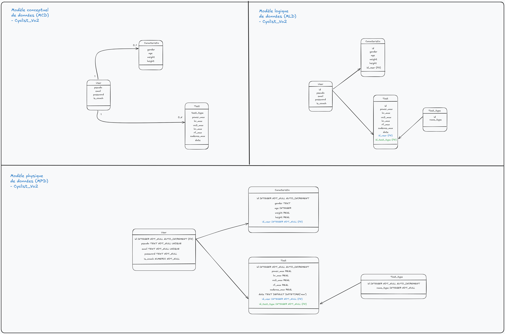

# Cycling Performance Tracker 🚴‍♂️

## Description

Cycling Performance Tracker est une application web développée avec **FastAPI** et **SQLite** pour suivre les performances des cyclistes. Elle permet aux utilisateurs (athlètes et coachs) de gérer leurs données personnelles, leurs performances, et d'analyser des statistiques avancées. Les coachs ont également la possibilité de superviser les performances de tous les athlètes.

---

## Fonctionnalités

### Utilisateurs
- **Inscription et Connexion** :
  - Les utilisateurs peuvent créer un compte (athlète ou coach) et se connecter via un système sécurisé.
- **Gestion des données personnelles** :
  - Les athlètes peuvent ajouter leurs caractéristiques physiques (âge, poids, taille, etc.).
  - Les coachs peuvent consulter les informations de tous les athlètes.

### Performances
- **Ajout de performances** :
  - Les athlètes peuvent enregistrer leurs performances (puissance maximale, VO2 max, cadence, etc.).
- **Mise à jour et suppression** :
  - Les performances peuvent être modifiées ou supprimées.
- **Consultation des performances** :
  - Les athlètes peuvent consulter leurs performances.
  - Les coachs peuvent consulter les performances de tous les athlètes.

### Statistiques
- **Athlète le plus puissant** :
  - Identifier l'athlète avec la puissance moyenne maximale la plus élevée.
- **Meilleur VO2 max** :
  - Trouver l'athlète avec le VO2 max le plus élevé.
- **Meilleur rapport puissance/poids** :
  - Identifier l'athlète avec le meilleur rapport puissance/poids.

### Génération de données fictives
- **Données de test** :
  - Génération de cyclistes fictifs, leurs caractéristiques, et leurs performances pour tester l'application.

---

## Architecture du projet

```
raoufaddeche-brief_sqlite_fastapi/
├── cycling.db
└── cycling_performance/
    ├── README.md
    ├── cycling.db
    ├── requirements.txt
    ├── .gitignore
    ├── app/
    │   ├── __init__.py
    │   ├── config.py
    │   ├── main.py
    │   ├── db/
    │   │   ├── __init__.py
    │   │   ├── database.py
    │   │   └── queries.py
    │   ├── faker/
    │   │   └── generate_cyclists.py
    │   ├── performance/
    │   │   ├── __init__.py
    │   │   ├── test_athlete.py
    │   │   ├── test_auth.py
    │   │   └── test_stats.py
    │   ├── routes/
    │   │   ├── __init__.py
    │   │   ├── athlete.py
    │   │   ├── auth.py
    │   │   ├── performance.py
    │   │   └── stats.py
    │   ├── schema/
    │   │   ├── catacteristic.py
    │   │   ├── performance.py
    │   │   └── user.py
    │   └── utils/
    │       ├── __init__.py
    │       ├── dependencies.py
    │       └── security.py
    ├── power_bi/
    │   └── export_data.py
    └── streamlit_app/
        ├── __init__.py
        └── dashboard.py
```

---

## Modèle conceptuel, logique et physique des données

Voici une représentation des modèles conceptuel (MCD), logique (MLD) et physique (MPD) des données utilisées dans l'application :



---

## Installation

### Prérequis
- **Python 3.9+**
- **SQLite** (inclus avec Python)
- **pip** (gestionnaire de paquets Python)

### Étapes d'installation

1. **Cloner le projet** :
   ```bash
   git clone https://github.com/RaoufAddeche/Brief_SQLite_FasApi.git
   cd Brief_SQLite_FastApi/cycling_performance
   ```

2. **Créer un environnement virtuel** :
   ```bash
   python -m venv venv
   source venv/bin/activate  # Sur Windows : venv\Scriptsctivate
   ```

3. **Installer les dépendances** :
   ```bash
   pip install -r requirements.txt
   ```

4. **Configurer les variables d'environnement** :
   Créez un fichier `.env` dans le dossier `app/` et ajoutez les variables suivantes :
   ```
   SECRET_KEY=your_secret_key
   ACCESS_TOKEN_EXPIRE_MINUTES=30
   DATABASE_URL=cycling.db
   ALGORITHM=HS256
   ```

5. **Initialiser la base de données** :
   ```bash
   python -m app.db.database
   ```

6. **Générer des données fictives (optionnel)** :
   ```bash
   python -m app.faker.generate_cyclists
   ```

7. **Lancer le serveur FastAPI** :
   ```bash
   uvicorn app.main:app --reload
   ```

   L'application sera disponible à l'adresse : [http://127.0.0.1:8000](http://127.0.0.1:8000)

---

## Utilisation

### Documentation interactive
FastAPI fournit une documentation interactive accessible à l'adresse suivante :
- **Swagger UI** : [http://127.0.0.1:8000/docs](http://127.0.0.1:8000/docs)
- **ReDoc** : [http://127.0.0.1:8000/redoc](http://127.0.0.1:8000/redoc)

### Endpoints principaux

#### Authentification
- **POST** `/auth/register` : Créer un compte utilisateur.
- **POST** `/auth/login` : Se connecter et obtenir un token JWT.

#### Athlètes
- **POST** `/athletes/caracteristic` : Ajouter des caractéristiques physiques.
- **GET** `/athletes/performance/{athlete_id}` : Récupérer les performances d'un athlète.

#### Performances
- **POST** `/performances/` : Ajouter une performance.
- **PUT** `/performances/update/{performance_id}` : Mettre à jour une performance.
- **DELETE** `/performances/delete/{performance_id}` : Supprimer une performance.

#### Statistiques
- **GET** `/stats/most_powerful_athlete` : Récupérer l'athlète avec la puissance moyenne maximale.
- **GET** `/stats/best_vo2max` : Récupérer l'athlète avec le meilleur VO2 max.
- **GET** `/stats/best_power_to_weight_ratio` : Récupérer l'athlète avec le meilleur rapport puissance/poids.

---

## Tests

### Tests unitaires
Des tests unitaires sont disponibles dans le dossier `app/performance/`. Pour exécuter les tests :
```bash
pytest
```

---

## Contribution

Les contributions sont les bienvenues ! Si vous souhaitez contribuer :
1. Forkez le projet.
2. Créez une branche pour votre fonctionnalité (`git checkout -b feature/ma-fonctionnalite`).
3. Commitez vos modifications (`git commit -m "Ajout de ma fonctionnalité"`).
4. Poussez votre branche (`git push origin feature/ma-fonctionnalite`).
5. Ouvrez une Pull Request.

---

## Auteurs

- **Raouf Addeche** - Développeur principal

---

## Licence

Ce projet est sous licence **MIT**. Consultez le fichier `LICENSE` pour plus d'informations.
